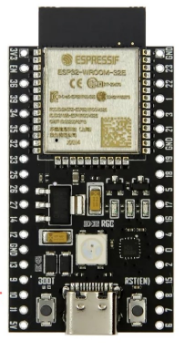
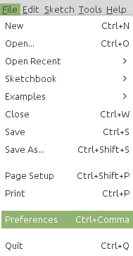
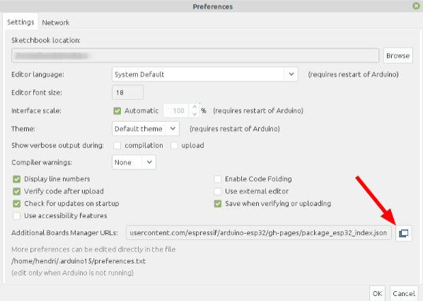
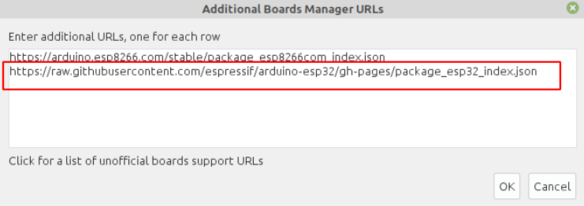
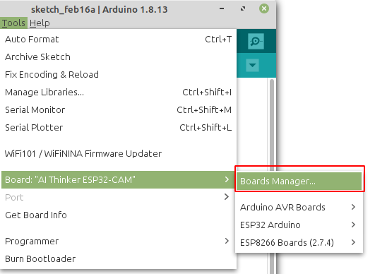
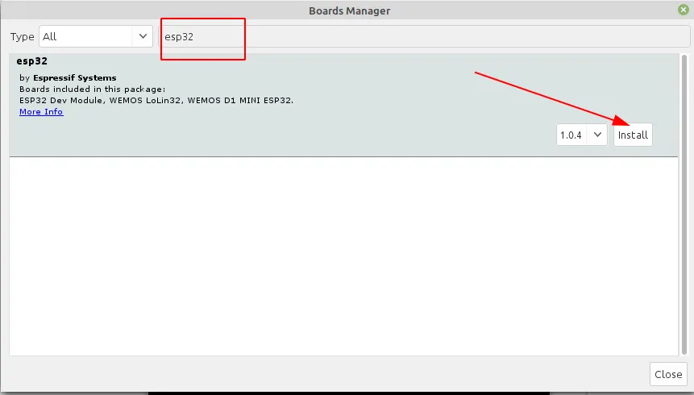
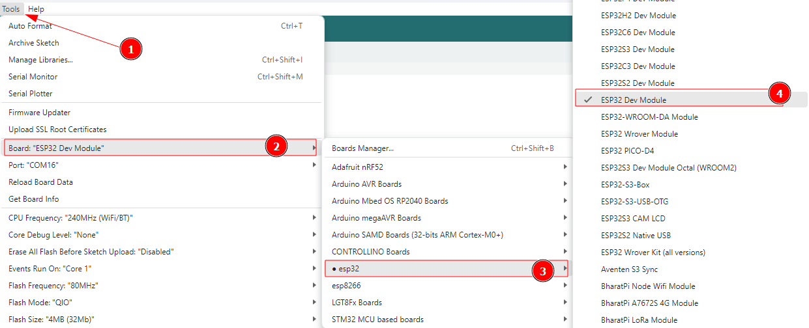
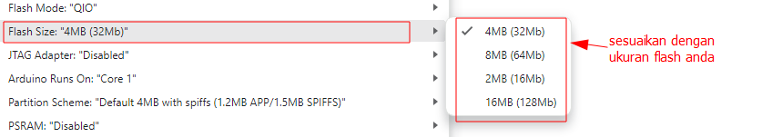
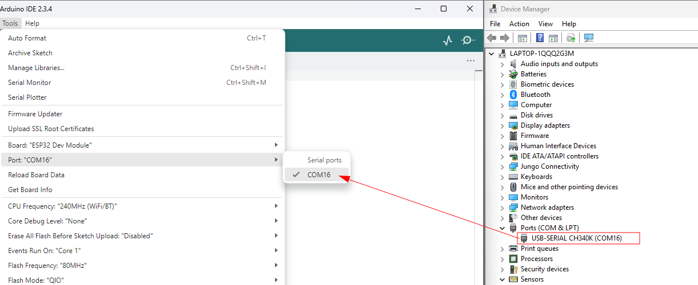
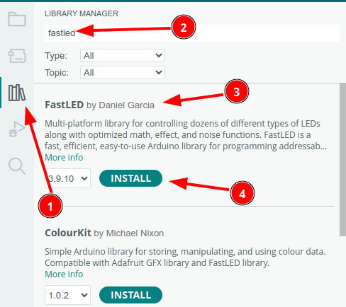

# Tutorial  YD-ESP32


| Perangkat | Pin/Alamat | Keterangan                |
| --------- | ---------- | ------------------------- |
| WS2812B   | GPIO16    | LED RGB addressable       |



[TOC]

## Install Driver

Berikut adalah langkah-langkah untuk melakukan instalasi driver tersebut :

1. Download File Driver CH340/CH341di:

   - http://www.wch-ic.com/downloads/CH341SER_ZIP.html
   -  https://www.wch-ic.com/downloads/ch341ser_exe.html 
   
2. BIla memilh paket dalam bentuk zip maka terlebih dahulu lakukan extract file

 

![img](data:image/png;base64,iVBORw0KGgoAAAANSUhEUgAAA5YAAACyCAYAAAA53lDDAAAgAElEQVR4Xu3dCdwUxZ3/8d+IopD1PoIgggoKGBEVT7wggsEoGOVvgvm7BFlxdYOAyiYeQWUVsy+i8VqNiBqMEWMQFVH+KgEPMCqgAQ1yrQoqCF4IBBQi8+/qnp6p7ume7jmf6pnPk/BCnumurnpXPfPMd6q6JvWPjRvSwhcCCCCAQA0FUjW8FpdCAIEkCcR5UeY+g8Q5Nkltb5q68nzcNO7JvWqxP38lj7CgH3C9MAOfAFJzX5tT82qlpGTi5I7CCtQ8rKPqR9OMltS/cwUGI0WUKWDGWC+zEZxusED1frEzdqvd7XH6zn0dFefY/Pr6z2rkPk1q24PqXWg0JLWd1f5pK638ygXLiH5JhyRLTwWq0e9umcWPm1Ta+iqNlbMQQAABBBBAAAEEEEAAAQQQECFYMgoQQAABBBBAAAEEEEAAAQTKEiBYlsXHyQgggAACCCCAAAIIIIAAAgRLxgACCCCAAAIIIIAAAggggEBZAgTLsvg4GQEEEEAAAQQQQAABBBBAgGDJGEAAAQQQQAABBBBAAAEEEChLgGBZFh8nI4AAAggggAACCCCAAAIIECwZAwgggAACCCCAAAIIIIAAAmUJECzL4uNkBBBAAAEEEEAAAQQQQAABgiVjAAEEEEAAAQQQQAABBBBAoCyB1JIlS9JllcDJCCCAAAIIIIAAAggggAACDS3AjGVDdz+NRwABBBBAAAEEEEAAAQTKFyBYlm9ICQgggAACCCCAAAIIIIBAQwsQLBu6+2k8AggggAACCCCAAAIIIFC+AMGyfENKQAABBBBAAAEEEEAAAQQaWoBg2dDdT+MRQAABBBBAAAEEEEAAgfIFCJblG1ICAggggAACCCCAAAIIINDQAgTLhu5+Go8AAggggAACCCCAAAIIlC9AsCzfkBIQQAABBBBAAAEEEEAAgYYWIFg2dPfTeAQQQAABBBBAAAEEEECgfIFUevOHaVn6S5Etn8m2tEja+pPapatsd+AokeZ7l38FSkAAAQQQQAABBBBAAAEEEKhrgVR6w8L0trk/kPQ2J1SmJWX93Uya7T9ImnX8lch2O9Q1AI1DAAEEEEAAAQQQQAABBBAoTyC17asF6a2v95VtVrC0UmRm1jIl2zXfVVLNWlhBMzOLaf29zZ7StP62EmizXbpIi+7jrWN2Kq8GAWd//vnncthhh8nq1auzj95yyy1y+eWXV/xa/gLVtU888UT505/+JF27di37epUur5QKbd68WX74wx/KrFmz7NN79uwpzzzzjGzatCmwrXqdO3bs6Dl32rRp9r/1r1tvvVXU91WZLVq0iF1FdZ3TTz9dnnvuOdlzzz1jn1fMgXpb2rRpU7BvBw8eLAMGDMi2L6jvVBsnT54sI0eOlDPPPNNudzHjxITx4Pr5x0VQ3wZZl9rfxfQbxyKAAAIIIIAAAggkSyC17R/vp7csHWvlxe2smcpt9h81ddl8531l+512t/77W+vPP60/WzP/rf7+p/XtryXVcZyVRasTLPVw5wZNFUIefPDBqgpX+oV/pcsrtvELFy6Uk046SR555JFsYFLfU/VSgSgoRPvD2PLly+XYY48Vdd6Pf/xjmT17djYIun3TqVOnmgbLuK7FBEs3NLpjzLW77rrrsm9qqFClvkp9kyNuvYvt51KOV3Up1LdBZZbT36XUkXMQQAABBBBAAAEEkiGQSm9Zm5ZPp1hhUQVKN0RaQXKbEyDt74n6W30v82/7+9afg39bMFjOnTtXtm7dKieccEJRGkEvvoNCTVGFxjy40i/8K1FeqY7ujNQVV1yRN8uoOMLqVuj7/hlGFbS+/vpreeONN2TSpEk1m7GM61pMsFRjbPTo0dl2uG1bu3at3HbbbaI8Bw4cKGPGjClqllIfenHrHXO4VuywuLPH5fR3xSpLQQgggAACCCCAAALGCaTS36xJy9pHcyHSDZcqRKpAuU0FS23WUv3bncHsdE/BYDlx4kQ7cPTv31/69OkTu/FBL779IcmdTVq/fr1drruMT1/O6C9HnfPAAw/Ir371K3um7oILLpBrrrnGPt9daht0jprx819HnaOu9fvf/94+/2c/+1l2NlWv29VXXy1Tpkyxl9bGWVYahFSqY1QYLzZYBs3oKc8LL7zQDmTqv9VSUrVEVM3oqeOVa9gSWT3MqHaH9Yl/yeZDDz0kv/jFL7JLpV37oP4oJljqwVH1lQqRI0aMkCuvvNJerqu+3GDt1lf1q7vENmg8qePCxoOaMS5nHN98882Ry5SD3lwI6hd/3waNQ/fnx+3vYt9IiP0EwIEIIIAAAggggAACiROwguUnafnkIe9spTtTqUKmPUuZ+WMHTXdZrPV3lwesYBl+T92WLVvknnvukaVLlxYVLqOC5XHHHWffg3nffffZL6zVC173frcPP/zQvgdOLWdUL5bHjh0r5557rh103GWMgwYNss93l9aq4y666CJ5++237Q50l4eqwBB2Hf2+On940c9R17zhhhvklVdeEb1uxYyUUh39M3D+a7rLGvV7Wd1jdtllF7vOqp2qDWrWUw/PeghT57gzfeq+TeWqQocKZoXun/QHy7A+ee2117J96tav0MxfWJiMusdSle2+MaHG2GWXXSYTJkyQq666yg7Pev8F9XnYeAobD4XGV5xxfMghh+S5BI0rf2jU33wJ6tugMsL6u5h7aosZ8xyLAAIIIIAAAgggkCwBK1iuSsuq+7UZS99y12yw1O6xdJfJfm+SiLXBT6GvjRs32jOEaknsuHHjYi2VDAuW7jJEdT3/vX7ui+W2bdtmQ44KBN27d7dffLsza2oZoz9ghAWRQtdRgVa9YFeBVn25QUwPWepFt162ekzNfur37MUdLqU4VmPG8vzzz7cD54wZM+yqq8DuD7CuS9RmMEEzlu6mSVFuQWMkqD/0vo4TLN0QpmZe3Tco3Dck3L5SbS40E+qvu7681v9YOeM47njyO7uBWQ+Fqt1u3wZtRqTfWxr1hkXcMc1xCCCAAAIIIIAAAvUjkEp//XFaPraWtGZnKbUZSjdU2stirWBpL4NVATMTMrta92YWCJalzrRF3WP58ccfhwbLXr16ZZcwqhnNO++8U4YNG2bPSKr75NRMmn831FKCpQqwbiho2bJl9t67QsHSfcHuzhJFBS93mJXqWOl7LFV9VIBXxvpSVLee7m6zM2fOzM4g+3eQ1X904gbLIDc1o6hvPKSHaL0/ig2Wbmg6+uijpVu3btkZ8bvuukvUvZbu/ZXVDpZxxrEbDOOMp6Bw7H8a8++K6z4eNrPt9jezlvXzC4GWIIAAAggggAACpQpYwfKjtHx4R265q3tvZXaznszSV89mPipkWt/v9owVLFuGXrvUewP9wdJ9YesuffX/2z8zp15EP/74454lsEuWLBG1dNA/26RCS6Glk/6lsG6YVMsz3fsHly1blg1S/uWN+lJYfSaomN1FS3VUHRM0e1jMrrAqnHbo0MHeBTZs+ak+g1XOUlj/TsBBO9bqy5n1x/X7Bv39oS9tjvooGTeMz58/P7sU2B1vylMtl/ZbRM2AF7MUVp/BjBrH+g9e1HhSfaTuFf3Od75jL+9VbXj99dcj+zboh5sZy1KfbjkPAQQQQAABBBCoX4HUtk0r0t8uG2MFyy3OfZbWrGRabdZjz1bmdopN25v6ZDbuUcekdpQdj1PBMnwp7Lx580TNtpWyK6z+OZb6/X5uV+ibnvgf1++5dDdI0T9zMCi4hoWPsOvoG8occ8wxsuuuu8pvfvMb+55EfUmmvnmPum/OXTq77777ZkNK1PAq1THISn2vmM+xVMeHbV6klx+0eU/U5x3GnbEMc3M361H3ft59993ZjWz0/ih2xlK1Kaje6lrqy/0okrgzloXGg3/znmLHsT7OosaTO17btWsXuMmUalvcGXSCZdRPLI8jgAACCCCAAAKNJ5DatuWr9DcfWzte/nOjbLM+vzJl/c/+O5VSH2dp/xHre87fzlc6nbImKltJy/1Ps45r1nhqtBgBBBBAAAEEEEAAAQQQQCArkEpbX3ggUE2BoHv0ombYGqk+lWprJZwrUUal2kM5CCCAAAIIIIAAAskRIFgmp6+oKQIIIIAAAggggAACCCBgpADB0shuoVIIIIAAAggggAACCCCAQHIECJbJ6StqigACCCCAAAIIIIAAAggYKUCwNLJbqBQCCCCAAAIIIIAAAgggkBwBgmVy+oqaIoAAAggggAACCCCAAAJGChAsjewWKoUAAggggAACCCCAAAIIJEeAYJmcvqKmCCCAAAIIIIAAAggggICRAgRLI7uFSiGAAAIIIIAAAggggAACyREgWCanr6gpAggggAACCCCAAAIIIGCkAMHSyG6hUggggAACCCCAAAIIIIBAcgRSS5YsSSenutQUAQQQQAABBBBAAAEEEEDANAFmLE3rEeqDAAIIIIAAAggggAACCCRMgGCZsA6juggggAACCCCAAAIIIICAaQIES9N6hPoggAACCCCAAAIIIIAAAgkTIFgmrMOoLgIIIIAAAggggAACCCBgmgDB0rQeoT4IIIAAAggggAACCCCAQMIECJYJ6zCqiwACCCCAAAIIIIAAAgiYJkCwNK1HqA8CCCCAAAIIIIAAAgggkDABgmXCOozqIoAAAggggAACCCCAAAKmCRAsTesR6oMAAggggAACCCCAAAIIJEyAYJmwDqO6CCCAAAIIIIAAAggggIBpAgRL03qE+iCAAAIIIIAAAggggAACCRMgWBreYV9//bXstNNOhteS6iGAAALJEFi1apW0bt06GZWllghECDCeGSLVEGBcVUO19DKT1B8Ey9L7uSZnEixrwsxFEECgQQSS9As6aV1y5513ymmnnSadO3fOVv3dd9+VGTNmyLBhw5LWnETUl/GciG5KXCUZV2Z1WZL6g2Bp1tjJqw3B0vAOonoIIJAogST9gk4UbKayY8eOlR/96Ed2uFSh8oknnpCrr746iU1JRJ0Zz4nopsRVknFlVpclqT8IlmaNHYKl4f1B9RBAINkCSfoFnVRpFS6POeYYeeONNwiVVe5ExnOVgRu0eMaVWR2fpP4gWJo1dgiWhvcH1UMAgWQLJOkXdJKlp0yZIuecc06Sm5CIujOeE9FNiask48qsLktSfxAszRo7BEvD+4PqIYBAsgWS9As62dLUvhYCjOdaKDfeNRhXZvV5kvqDYGnW2GnSYPnUU0/Zmyxs2rQpVKVly5bSo0cP+clPfmK4HNVDAAEE8gWS9Aua/kMgSoDxHCXE46UIMK5KUaveOUnqD4Jl9cZBRUqu1eY9kyZNkg0bNtibLrRo0SK07l988YVMnz5d9t13X+nXr19F2kghCCCAQK0EkvQLulYmXCe5Aozn5PadyTVnXJnVO0nqD4KlWWOnyWYs1Vbwo0aNkj322CNSZPPmzTJmzBhRW8vH+1oktw7+o8w6/qfy9NAu2inq+zNk/5svkwGt4pXEUQgggEA5AoV/QWeeq7QLHHjuCLn9zL3LuWSNz9WeV+VFGX7VQjnJfY59809y1p0LRdr2lnsuFRmnPxarljxnx2Kq4UGFxvPr46+RG/+aX5nkjekagnIpWyAyyLjPJfbRXeXaB38sx37ie77BsmICkf1RsSuVXxDBsnzDqpZQqxnLIUOGyO233x67LcOHD5f7778/5vHOi5EVbddIu7NvksuPdE/jRUpMQA5DAIEKCUQHS/3NrrA3xfyVMem5LKwuTltkmP4cXCyqSe0stu71eXy8F5z0W332fvVaVXBc2QFyjZyvwqSqgvXvyatOlQHZ13bVq1ejlhzv59wMHYKlGf0QWot6Cpb7D+sqrzwpMmrMqbKf3WJ+2Rk+/KgeAnUnUFywdF40eV5EBYqY9FxWKFiWu0LEpHbW3dAsqUHxXnDSbyXhNvBJBceVmq188rtyT/a1XAND1ajp8X7Oa1SZiMsQLM3oh8YIltZyrLZTr5FHWrtLy7y/7DzLdrLLZjPHqFB65wvyniXV03rH/bxVd8glj6+x3TzLeuwXgc5x2eUZhvcx1UMAgdoJFB0s5VOZPPo2WZlZbZH/PCXOUn+3Ce5zV+RzUTnPbc7zYHb1h3atA8/tLe0eX5i5xcB9jj1NVl6Vq6PznPmp91aEsPqGll27PuNK4QLxXnC642CgyN25sWyXmg0J+8hj6tYU7Xctv1sbd+RFP0/+UVbk3SaQe0133LzcazRbMfbzYuOaF2p5vJ9zM+wIlmb0Q8MEywGt9DAZ5531zFI0dU/QGGumM7OuP/sLz/63OOv7/TOg1mPDV/VK2P1Rhg9IqodAwgWiXzD5Z/W8wTLX/ELPZb7ntsDnomKf27RlrJ57mbxLXD+apl7QiQyy76uMW8ew+qrwmbuut+yED4Q6qX68F5xa/66yfmfOOyy734F6o2ROd/UmhW885o0x7eeC3611MnrKecPCeV6c+KH+JlfQazr1vbelB6/Ryhoz8X7Oy7pExU4mWFaMsjoF1dVSWH0DCfsXm3qn3/vLyt5Ywv76bsALI/V9/xOX9m97owp3tjJTTN6GQdXpJ0pFAIFkCJQWLCeJXJrZZMyzaUXI85Rn9i/suajAc5m9mZn/uU27p8l6NBsIWlvPe3eH3WIQM1iGPXf2W1ug7GT0d73XMt4LTv840F7oj14r541Rt6fkhwLPGON3a70PJU/74o0r65TMc107ewVFgTGk7r+M9bzYUMyxGxu7P2KXWL0DCZbVs61IyXUZLLNLy34qcmcmWNovbNwXTuqdMPeFXHkvvirSCRSCAAJ1I1B0sNTvsfTcb1ngeaqk+zKj3jSrdrD0lm93uGpHaGitmyGR6IbEe8HpHVtq5nmcDJRRMsn+29n12D/+tJl69eaFvllLosWofByBeOPKKcleybDqtODJAm12PN796nFq13jHFNMfTa1DsGzqHoi4fn0GS/2dq8w7/mp5jnszeKElOIVmLO1lX0Hr/g3vZKqHAAI1EyguWHqXmebuR7NmeCKfp6Kei4p40yzz3Jbd0dUTXCu1FDbsnimWwtZscJZwoXgvOH1jzX7DwNqlXdbI/u5MvP27VRsDAWMs/566EirMKYkQKLx5j7ULbGtrF1h7ZYXzBsQrx/jv29aXwLpN5jVaqZ0f7+e81NIrex7BsrKeFS+tVsFSfY7l6NGjpUWLFpFt+OKLL2TcuHFFfo5l/m6E3vt1cuv1pW1X6Zn9hVfMiy89sGaawVLYyP7kAAQaSSA6WGob8WSX5LtCYc9TztJU+zMDAzep0L6fxS7nuc1dgpspTFueG7x5j/9+S3VeQNjQlzu67Qgtu5FGjbltjfeCM3iJ4o2if7a0c4wcLzLrr87GeGEbRNkP8rvV3EFRgZoV9Tzp32wxs1Gj5zNU3X0y/MthGUexeivez3msoqp+EMGy6sTlXaBWwXLq1KmyevVq6du3r+yxxx6hld68ebNMmTJFdtllFxk40Nphji8EEEAgQQJJ+gWdIFaq2kQCpY7n3KY9bsWDNl5pokZx2SYXKHVcNXnF67QCSeoPgqXhg7BWwVIxPProozJ79mxR4THsS81o9u7dW/r372+4HNVDAAEE8gWS9Aua/kMgSqCk8Zx376y6CsEyyrqRHi9pXDUSUI3bmqT+IFjWeHAUe7laBsti68bxCCCAQNIEkvQLOmm21Lf2AsWNZ3cpt28ptV1tgmXte8/cKxY3rsxtR73ULEn9QbA0fNQRLA3vIKqHAAKJEkjSL+hEwVLZJhFgPDcJe91flHFlVhcnqT8IlmaNnbzaECwN7yCqhwACiRJI0i/oRMFS2SYRYDw3CXvdX5RxZVYXJ6k/CJZmjR2CpeH9QfUQQCDZAkn6BZ1saWpfCwHGcy2UG+8ajCuz+jxJ/UGwNGvsECwN7w+qhwACyRZI0i/oZEtT+1oIMJ5rodx412BcmdXnSeoPgqVZY4dgaXh/UD0EEEi2QJJ+QSdbmtrXQoDxXAvlxrsG48qsPk9SfxAszRo7BEvD+4PqIYAAAggggAACCCCAQL4AwdLwUcHmPYZ3ENVDAAEEEEAAAQQQQAABIVgaPggIloZ3ENVDAAEEEEAAAQQQQAABgqXpY4BgaXoPUT8EEEAAAQQQQAABBBBgxtLwMUCwNLyDqB4CCCCAAAIIIIAAAggwY2n6GCBYmt5D1A8BBBBAAAEEEEAAAQSYsTR8DBAsDe8gqocAAggggAACCCCAAALMWJo+BgiWpvcQ9UMAAQQQQAABBBBAAAFmLA0fAwRLwzuI6iGAAAIIIIAAAggggAAzlqaPAYKl6T1E/RBAAAEEEEAAAQQQQIAZS8PHAMHS8A6ieggggAACCCCAAAIIIMCMpeljgGBpeg9RPwQQQAABBBBAAAEEEGDG0vAxQLA0vIOoHgIIIIAAAggggAACCDBjafoYqF2w/FzG//Q+GSsny6w/niAHRMD85bpfy28PvEimDdrTOEJVtyHTusj98/vJ942rHRVCAAEEEEAAAQQQQKD+BJixNLxPaxYsV7wqZ169WMT6f78pF8rQdoVhjAmWL0+V9vfuFSsMG97VVA8BBBBAAAEEEEAAgcQKECwN77qoYLl582Zp0aJFZCuijnOD4sj37pMhco58cMPBBcskWEaScwACCCCAAAIIIIAAAg0jQLA0vKujguXEiRNlt912k/79+4e25KmnnpJ169bJoEGDQo5ZKlceNVsOVjOVYs1cnvOZjIxYRhoULN+f+ICcesfa7DVSZ+oB1Vlqu/Tii+Tge++Tm6yZ0ZTsI1f7ZkdVuRdOc4pIdTpZ7u+zWIa8d2Jg0NWPtY/PXM9fN+ff50i/56fY11Vf/+e3v5TftFNtfVneVudK/tJZvT1BdfVgqhnfTFlu3f1LiuO0rbCh4YOV6iGAAAIIIIAAAgg0rADB0vCujwqWW7ZskXvuuUfat28fGC5VqPzggw/kkksukebNmwe31rOc1A2AVvA6ORzHH95UIOp5x17afY2ZezY7uOEy8+/FuTBp3wu5PHdPp//fYtWr3chF2cAYWJuApbBBwXLItNx13fCmgqsT/vx1FbHb83yn3BJbdZ2REnrf5vsTp8oLp/bLLCHOLy9O26INDR+sVA8BBBBAAAEEEECgYQUiguV0uTh1o3RZNkeGd2hYoyZteFSwVJULC5exQqV1fmBIDJkldDG852gznvq9mfYsnjv76YStqX20DX88jweXYQeyQktz4wZLTxnqWlNE1KylG5495QTVJV7gzg6WyPIc91zb4hg26VDk4ggggAACCCCAAAIIhAoQLA0fHHGCZVC4jBsqxQ53i70b9gR9z+fkCZahs3l6WAoIZvp1Qpbg2rN4hUJuzGDp3cE2IMTp5WRmSoOGhr2ENmQmN28Zqzsj6gnQuVI9bYtlaPhgpXoIIIAAAggggAACDStAsDS86+MGSz1cqhlMtey14PLXTLv9YUjnOOyy8I8TqXiwXBG81LSpgmWhZa/5Q8aZAZ2cXVprHeELqkHlESwN/+GjeggggAACCCCAAAKxBbLBcvrFKTljfOa8oc9K+t6+1j9YChtbskoHFhMs3XA5c+ZM6dWrV/g9ldm6BixP1QKn5x5DX/s8wTJshjNgKezSi7UZv7wZS9/MqXXNSi2FLWrGMsaMrYcjYEbSc49mSHmetsUyrNIgo1gEEEAAAQQQQAABBMoUSD2bTqdVhMx96WGSYFmmb9mnFxssi7pgoQCV2eW0U8jSz+ANcvSdVf2hNWIpbLvMhjeS28wn9uY9vk11gneF1WdfI5bCuoF2mq891y2R3jeozX58X37HjN07/s2BItpmB03/Nf33pRbVwRyMAAIIIIAAAggggEBtBFK3LUun7Y15pl8sqeyU5Qlym71hD8GyNt0QfpVqBsu8nUo91cjf2VR/OM7HjXiX0kYFS1W6c4z7kSDq40NmHTi78D2W2jmFP26kuGCpauP/OJNCS4M9H02iAuXFn0nPe/fK7Sobs23+pcmFrtnUY5PrI4AAAggggAACCCDgCjjBUm6XHh0XybXpe6WvLJfbe1ifdziRYGnCMKlmsDShfVF1CAqwUeck5fF6bltS+oB6IoAAAggggAACCFRGwAmWy6zZyhu7yLI5w6XDchUyH5PzmLGsjHCZpTR0sIz47MgyaZv29HpuW9PKcnUEEEAAAQQQQACBJhDILIVVs5QdZcSrVg1OGCpD5R3pwoxlE3RH/iUbKVj6l56mRL/H0YjuKLkS9dy2klE4EQEEEEAAAQQQQKBuBCI+bqRu2pnYhjRSsExsJ1FxBBBAAAEEEEAAAQQaXIBgafgAIFga3kFUDwEEEEAAAQQQQAABBIRgafggIFga3kFUDwEEEEAAAQQQQAABBAiWpo8BgqXpPUT9EEAAAQQQQAABBBBAgBlLw8cAwdLwDqJ6CCCAAAIIIIAAAgggwIyl6WOAYGl6D1E/BBBAAAEEEEAAAQQQYMbS8DFAsDS8g6geAggggAACCCCAAAIIMGNp+hgoN1gu/VLkr6tEvvnW9JZSPwQQQAABBBBAAAEEGldgx2Yix7cWOXj3ZBowY2l4v5UbLCf+XaTtziL/0tzwhlI9BBBAAAEEEEAAAQQaWGDjFpEPN4gMOjSZCARLw/ut3GA5fqFIt31EmqUMbyjVQwABBBBAAAEEEECgwQXmrxEZ2jWZCARLw/uNYGl4B1E9BBBAAAEEEEAAAQQqJECwrBAkxeQLECwZFQgggAACCCCAAAIINIYAwbIx+rlJWmlysNzOWl77xAO3ybOTHw602bp1qxx3Wj/512FXyU4tWjaJHxdFAAEEEEAAAQQQQCApAgTLpPRUAutpcrB87Hf/Lef27Snr1q3Lkz3wwAPlyy+/lBEjRsgl198hnbselUB9qowAAggggAACCCCAQO0ECJa1s264K1UjWI6fsVwmzV4pGzZvDfXcucUOclb3NnL5mYeEHnN297ZyxBFHyPz58/OOefPNNy4Vwp0AABPDSURBVGXu3Lly8803EywbbtTSYAQQQAABBBBAAIFSBAiWpahxTiyBSgfLW55ebIXKFbGurQ4a2ruDDD3toMDj+x3ZRtq3/6O8+mtrNvIM65CNucPWr/8XeemlZwiWsaU5EAEEEEAAAQQQQKDRBQiWjT4Cqtj+SgfLntfPLDhT6W/Kzi22l1nXfz/77bWrP5LPP10jhxzaTc4+en8rWE6WVy85XuRi65BNerAUK1hOixksrRnUMzvKLfMy53e/TZ6YNlzaynQZ2+pGOeC1OTKwvV4z/fvec895JC1X9/K24sPxPeRHU8/LlFlMZ6nrPCmnfHKv9CjmtKKO1dsS1l6nwDmjUvJSX719AcfPvFi6Tz9b5v3HUrnwuMekd55dVOUK1yHq7Mo+Ht23Qdcrvb8rW3tKS7DAkokycbJIz2sGyf7+ZqjH3j1CBp3dVVY+eZnMsj4rWH3tfuo10q/Hdz1HfzXn1/LkoiPl7Iv6yK76I3HKsOvgrAbJK9tXP/s6L67y1fQoT/3jHJMtoITy9YvbLvJvtlHua6G8fNMEef9Q//edI5z6iRzx77+UrnsmeOwYWvXgPim1sqovn5XdVF/J8zL1d29K+0r02+cVLKvUpnFewwkEP4+vkYX33SRvrXU4Dhhwh5zsLuAr9NxsH639fNjPZZmy9lbPfeI8D2rKnrIz3ydYNtwwrF2DKx0su//iuaIrP++/T7fPUaFyyvhx8tTkSdKr30+k59GHyi67nCX/+Z+PyUcfXWIdsWO27PXrYwbLD263AtAI6aAHQut7k94bLgN7xQmW02XOzL7SQ4VJu6xFMsQTBFUZZ8iUbFgtpvnlBMu4AS1+sBQ3NI7r6zQiYydjlskDQzvY31Kh6jqZmP13Ma11jo1b7+JLLv6MqL4NKrGc/i6+hpxRbwLuC4Cj5AArMLbPC5bq8QdFznFeUC/8rI90tV9s+F9IuN+zXkDsc6YvWMYpQ5X3Vub6etlR9XP6Q4W0l2RwXtDVeyv4mAqUr8LBlNWym1h/lFM2JDrtWGd9rnJ7z/c1K2lNsKzGj1Ron5R6saDxXkpZlSqnlGtzDgKWgPWzEfw8vlBWLukq+6vnd/sNj9XSzf59oI/ZsPHr/b4Krn/b233j0XeOp+xcjxAsGZ1VE2iKYDnoxDYycfbH2Ta5wXLTV5/Jgucfle23315Gjhwpmzdvto/p3r27dZ/lt9Z/Ncues379y9aM5cyIGUtnRur9y/NnGZ2C4gRLnT4/CKqg9Qc5T5ZPFbnBngUt5suwYKmC5M9z7ci2bdnB8oAdNpXnIJG7/DO8xbY5aJa4mDKqcWy8viivv6tRb8pMpoAe7LQWqBcBr7SSfp6ZOPW4FhYzQUoFtwVypKxbJHKKPmMZp4zPcrOiqvT8EBhSP7uqhR5z2xJ1TOnlu3U9RR70hVvnBZUcKrJub1/otWdwrVmBv1thtBIzX8kcdFWrdXiflHrJSgXCSpVTajs4DwFdIP953HlUez6036TJPaer0PhBZ202M3u8M6PfbrG1EuPTM7TVG/4xH/wzQLBkZFZNoNbB8vf/dpjMWvy5FSxzy6rcYHlej45yw/XXyX777SczZ86UPn36yIQJE+Thhx+2g2avXrk1qDvvvLMsXrxY/vznP8vPh10mgy+8UJ57e43XKXCGUT+kyGAZNKP3P1boUstC7UD2Q5ltBdkX+mVm+NTxt3YpsERWDzOZuoz5ntwyerxdya7ZmUL/kk3rxdP51iyp25QLnpV5VvBTS1mH/yHzzcz3vOE5arZQD47uf18r7x/nLtcNqK+9FLZQ3a36ZGY+F9ptuk06jH4st/xYe0zV3F1q7F2W66u3Oke5j+voWeIctEzZCcO+NxeC+sXft0E/ce51s/1d7BsJVfsxpuDECQQHKzss7vXL3JKobLt8x7vh8aRPPC9C1OFxytjVP+OoLZ3Ne6Hjt7WOnfrZDwrOVop+jCr75X19s6oFgmXB8r2zsfoLsNys7hmy7nfubKyqvHuO+n5meSVLYSv4ExOjTwYcKR9MniZfWlfNLbvOvOAt9Jj9JkDIsj/fEkJ9uaHYy6F9SwKz39PGgD2b49RLfeWWDGaueeq+8taLIcvFKyhIUY0iEPK853n+1cNn2POkNj4XBT23amM877ndsSZYNsqYa4J2VjNYnn3kPvLkm5lnf6ttQaFSNdkNllf+375yQNt9ZeFCFUGs2yov/rkVHL+WF174L2nVapu0adPGI7TXXnvJ4MGDZeXKlXLttdfKqyu/8Qr6ZuDyeTPLGgPdT5ArMvcP2vfUjX5VJBvW1AlaCBN9ps8NX2fLS5H3T/qDmhUW3WuooHO+yO1q2W1g6CkUEsOWv0YFS/0+S+vYM5fKBdYs7MpRPWTlf1gB8r3M/ZX27KX/GiF1t4+zdl7KLEV2LCVj633MCaCZ+zb1a1ntv/DWd0T6OUtws8txO4xz7vd0l+6G/fz4/PTQGty3QQWF9XcT/NByyToQCHrBEB62vEudol7I66EqR6WXkTdDGTtYhr3jrneJ75iigmVE+Z538/3H5gLIbq9o7/Jnz2klC9z79giWlfsZiuwTbbm25x5H1V+FHnNfHOcv1f6gS/79xrkGFVpK6H9sgoh7b1tQ3dz7dQvdE105SUqqcwHv87h737c1yeK/L1x7wyPo/kjnTTTnPsr8x3OPOZzee+FdYoJlnQ+2pmxeNYPlz6wlr6d02l0GT3gnNFTqwfLdhfNlwk0vWktfr7BJbrnlXDnhhJ6ybNmtctFFA+WUU07Jo1qxYoWsWrVKxo4dGxws8+6J1IsoYcby/HfsUHTi89q9hv4Aa4fC8dnZt/D+DZsBVGdodVPB1bpPVL/XMXAZb+a6zvXcYFzEPZbqNDeE9X0yG9rcIHeDDNLuryxUrq/u2vLa/HZ571nNhr4Dc2HdDrZ9z5MXbnVnhTPLcQNdgrR9zpnA7Fm2bNs5fevdyMkpz3NvaeQbFk35E821kyEQECIDZ+qcexL1F9KeUOhbNuWZKcxCRJShjosbLEOX2WrqcY4JW04bca4/ENsb8mSXgWmhQW34kllO9lV2KRnLIqvxsxG7TzJhPre0L78/gh/z9Wv2XjRfa7QNTyR7L22BZYH2pkDufW1OWeF1Y+xUY+w0Tpn5z8Getttjd7Vz/7f23KU2ZCu4FNae7fdvbOUbqyEbVhEsG2f01byl1QyWqjEqXF539kFy/ZPLPctf9Ya6M5YqWF7Q50XrISdYWjFCLr30IJkx479kwIAB0rx580CfKVOmyGU3/o90O+ZE3+OVvsfSndHzLUV1r+pu4FPpYNneuYA7u+Ys+QxYHpoN0fqS1iKDZSY0Den3mLzUYY6zA669BFSk97uPafdXVjlY9tKW4v5czZyqZcbjZP+7usj9nqDqdwn+EQoOx95j83fFdR8PmdkuacOmmv+Ic0EjBfzBMmimLuh7/nejM42zN/A5XFa4G/9kZ+RCZgB9QTLuPZbhy2xzyHGOCbtPs/C5IW3PviPvn9myNkE62Xrh9bJ7vxLhoPI/CsX0ibq68wJ73cnqnrHgJa75j8UIlp4NSvxLCfXlz4XLIlhWfoRQYpxVHrkAefhnvo3RApeyauNY3S/v2WG80M9VrjcIlozMqglUO1iqiu/WcntZt+mfoW3Qg+XKuS/KsGFOsLzrrltkwYI3reWwzoY+YV93T/6LHH50D0mlUvmHBIW8YnaFfc/aObSXtSusXXLIDKdnBqucpbD6pjbB18rNnC3zflSKft+gvqTUvf9Rvxey4EeEuPdz5pYCO+1W93QOdZbm5ln465q/TDb+UtjcDKbdVmtTJH0J7B+WfU+WdxyVtytt5G61dh8tErW37SnTMm2YGaNvgwYdM5ZVez5qnIJ9wTJopi7k3hiPkT5jWUwZobsQuqUHLcuN8wIp4JjYS2Ejyg8sp0BQycxg5d3Tx+Y9lfsxi9UnE2Sd+1E5eeOu0GNFLIXV65G3pDUkWNr3bvqXwgbtzKm4eFOicoOmwUoKex5fYu0Ke4i1K6zN4QuK2j3p/uWzjp53PHo/dooZywYbYeY1t9LBspzPsVQzlmsWvihXXOEES3Xf5Ovz3pLh5w2R1j/oL5u3fCPvL7O29st8dbb+3mD92bVjZ9nWomU4rm+DGCnmcywzyy2duz5zm8t4LpYNGt7Ne6I/7zDmUlh1v6G1tNb5yoW77GY99n2Z2kY23YfKOfKOHGDv3lrkjKV1haB629cSZ5Mg5yvmjGV761BtiW7hzXv0MGud5wnIAf/2LP3VQ2/QUMgE5s5aG0I2Dor8KSVYRhJxQJSAN7gFzdQFfS5k3udNasFSAjb+KViGtnQw+D4d/72aQWHT387gJb7xNu8pXH7wC6zMfUr2cli1WYseIlTo/H+y20XuZ4USDqJGZbGPx+0TtVPv+393Nuzzb5BT6DFnB9+g5ay5z+lzytM+E3Af66N8tI+iyW7qE7l5j/5RNAWW0HJ/brHDpKGPD30O7rQgZOMo7d5LJRf4ubzBy8hnfapWrqh7yfXPsQz+iCVmLBt6WFa38ZUOluNn/K+Mf2F57Eqff2I7ufysTvbxzj2WV9gfL6K+Frzzrvzr5TfIuaP+XZZOmSXvvGctiezTXay7DSV11U3y05uvkRet/z7j+XmyqetRsa/JgQgggIA5AtaLhPs+kcP1jwwpunKVKKPoi3ICAhEChcI8QZ/hg0BTCRAsm0q+Aa5b6WCpyG59eok8Pf9j2bB5a6jgzi12kIE92snQ3gdlj/l68ybPjORO1izkAdZsZGcrTOrB8s93/UFufuh38sKXX8iaw61AOXSE4cEy6B69qBm2ag4+0+pTqbZWol2VKKNS7aEcBBBAIMkCBMsk9x51r18BgmX99m2Tt6wawbLSjdrOCpx9jj1I2rQ/SDoddqQ89cj98tTr/yvnHrGfyHbNZPwzr8rBzFhWmp3yEEAAAQQQKEOAYFkGHqciUDWBRAfLRYsWpasmQ8GhAp07qzsQo7+SECyjW8ERCCCAAAIIIIAAAgggECWQ6GCZtr6iGsjjTSdAsGw6e66MAAIIIIAAAggggEAtBQiWtdRusGsRLBusw2kuAggggAACCCCAQMMKECwbtuur33CCZfWNuQICCCCAAAIIIIAAAiYIECxN6IU6rUO5wXLi30Xa7mx9luSOdQpEsxBAAAEEEEAAAQQQqAOBr76xPq/c+hD4QdbnyybxK8U9lmZ3W7nBcumXIn+1Pvf4m2/Nbie1QwABBBBAAAEEEECgkQV2bCZyfGuRg3dPpgLB0vB+KzdYGt48qocAAggggAACCCCAAAJ1IECwNLwTCZaGdxDVQwABBBBAAAEEEEAAASFYGj4ICJaGdxDVQwABBBBAAAEEEEAAAYKl6WOAYGl6D1E/BBBAAAEEEEAAAQQQYMbS8DFAsDS8g6geAggggAACCCCAAAIIMGNp+hggWJreQ9QPAQQQQAABBBBAAAEEmLE0fAwQLA3vIKqHAAIIIIAAAggggAACzFiaPgYIlqb3EPVDAAEEEEAAAQQQQAABZiwNHwMES8M7iOohgAACCCCAAAIIIIAAM5amjwGCpek9RP0QQAABBBBAAAEEEECAGUvDxwDB0vAOonoIIIAAAggggAACCCDAjKXpY4BgaXoPUT8EEEAAAQQQQAABBBBgxtLwMUCwNLyDqB4CCCCAAAIIIIAAAggwY2n6GCBYmt5D1A8BBBBAAAEEEEAAAQSYsTR8DBAsDe8gqocAAggggAACCCCAAALMWJo+BgiWpvcQ9UMAAQQQQAABBBBAAAFmLA0fAwRLwzuI6iGAAAIIIIAAAggggAAzlqaPAYKl6T1E/RBAAAEEEEAAAQQQQIAZS8PHAMHS8A6ieggggAACCCCAAAIIIMCMpeljgGBpeg9RPwQQQAABBBBAAAEEEGDG0vAxQLA0vIOoHgIIIIAAAggggAACCDBj2RRjYP3GjfLUczNl7z32kJ49jpEdmzcPrQbBsil6iGsigAACCCCAAAIIIIBAMQLMWBajVaFjZ855XRYvf88uba89dpf+p/cKDZcEywqhUwwCCCCAAAIIIIAAAghUTYBgWTXa4ILVbOXDjz/tebBQuCRY1riDuBwCCCCAAAIIIIAAAggULUCwLJqstBO+2bJF3n53qfxt0WLZsmVrXiFtWu1jzVx+P+/7BMvSvDkLAQQQQAABBBBAAAEEaidAsKyB9QIrTM6Z+1bBK6lZy/PO+gHBsgb9wSUQQAABBBBAAAEEEECgsgIEy8p6Bpa2YeM/rM16/iLrrb/9Xzs230EO63yIdOtyiDQP2MSHGcsadBCXQAABBBBAAAEEEEAAgbIECJZl8cU/WYXLx56eLt9oy2A7dThQTjz6iMBA6ZZMsIxvzJEIIIAAAggggAACCCDQNAIEyxq5z13wjsz929vW7q87ZMOl2g22TavvFqwBwbJGHcRlEEAAAQQQQAABBBBAoGQBgmXJdPFPdEPl0Yd/T9Qspbss9tJBAyMLIVhGEnEAAggggAACCCCAAAIINLEAwbLKHfDxJ2usIDlTVKg8utth9tXUslj1fRUyo74IllFCPI4AAggggAACCCCAAAJNLUCwrHIPqI8Z+eyLLyOXvIZVg2BZ5Q6ieAQQQAABBBBAAAEEEChbgGBZNmF1CyBYVteX0hFAAAEEEEAAAQQQQKB8AYJl+YZVLYFgWVVeCkcAAQQQQAABBBBAAIEKCBAsK4BYzSIIltXUpWwEEEAAAQQQQAABBBCohMD/B4Ogx0ctlw6uAAAAAElFTkSuQmCC) 

4. Kemudian Klik INSTALL seperti tampak pada gambar dibawah ini.

 

[](https://blogger.googleusercontent.com/img/b/R29vZ2xl/AVvXsEgP_rldnd8OU8ce2KMB7f8zgtJw4UjxRCDLVDdTS6iaIvm6QhNRkKfnxXUDKUMFfy7ZS6XF9a3sMQdQxGNX0DqD3xOF0xbEY-RlDIeh04rYDAy8Ca0aA8GHdG8x9FOiE7-Ek18jwDDTC5_I-wKP6xljMmCp3NTO6OWFP18eZ5tROIb5I-qAbv4Er0-2zxs/s433/Install CH340.png)

 

5. Driver CH340 atau CH341 untuk Arduino sudah Ter-Install dan siap digunakan.

6. Silahkan digunakan untuk Upload Program dari Arduino IDE ke Board Arduino yang anda miliki.

   

## Install Board

1. Pastikan Install Driver CH340 terlebih Dahulu bila belum terinstall. 
1. Masuk ke preferences



2. Klik Additional Board Manager



3. Tambahkan board esp32 kalimat berikut https://raw.githubusercontent.com/espressif/arduino-esp32/gh-pages/package_esp32_index.json



4. Pilih Tools -> Board -> Board Manager



5. Search ESP32 kemudian klik install



6. Pilih Tools -> Board -> ESP32 -> esp32 dev Module



7. Langkah berikutnya adalah memastikan Arduino mengetahui Kapasitas Flash yang tersedia. ini dilakukan dengan cara mengatur konfigurasi "Flash Size".  Sesuaikan Flash anda menggunakan konfigurasi seperti pada gambar berikut



8. Pastiakn serial port telah sesuai, untuk mengetahui nama port serial , pada OS windows bisa menggunakan device manager



## Contoh Kode Program

### Test WS2812 menggunakan library FASTLED

LED WS2812 adalah jenis LED RGB dengan pengontrol bawaan yang memungkinkan setiap LED dikendalikan secara individual menggunakan satu pin data. Untuk mempermudah pengendalian LED ini, kita dapat menggunakan library **FASTLED** yang menyediakan fungsi-fungsi intuitif untuk membuat efek cahaya yang menarik. Panduan berikut akan membantu Anda menginstal library FASTLED di Arduino IDE dan menguji contoh kode sederhana untuk mengontrol LED WS2812.

#### Langkah-langkah Instalasi Library FASTLED

Pastikan library **FASTLED** telah terinstal di Arduino IDE Anda. Jika belum, ikuti langkah-langkah berikut:

1. Klik ikon **Library Manager** di panel **sidebar** Arduino IDE.
2. Ketik **FastLED** di kolom pencarian.
3. Temukan library **FastLED by Daniel Garcia**.
4. Klik tombol **Install** untuk menginstalnya.




#### Menggunakan Contoh Kode

Setelah library terinstal, buat file baru atau buka contoh program di **File -> Examples -> Basics -> BareMinimum**.  kemudain yang harus anda lakukan adalah:

1. Gantikan kode yang ada dengan kode berikut:

```c++
#include "FastLED.h"

#define DATA_PIN 16      // Pin data LED
#define LED_TYPE WS2812  // Tipe LED
#define NUM_LEDS 1       // Jumlah LED
#define COLOR_ORDER GRB  // Urutan warna

CRGB leds[NUM_LEDS];
uint8_t brightness = 128;

void setup() {
  FastLED.addLeds<LED_TYPE, DATA_PIN, COLOR_ORDER>(leds, NUM_LEDS);
  FastLED.setBrightness(brightness);
}

void loop() {
  leds[0] = CRGB::Blue;
  FastLED.show();
  delay(50);
  
  leds[0] = CRGB::Black;
  FastLED.show();
  delay(50);
}
```


## Upload program

Bila tampilan seperti ini maka anda harus mengkonfigurasi ESP32 anda agar bisa melakukan download

```
- ---esptool.py v3.0-dev
- ---Serial port COM…
- ---Connecting........_____....._____.....__
```

Langkah yang harus dilakukan

- Tekan dan tahan tombol Boot/0  
- Klik(tekan dan lepas) tombol reset/EN sambil tetap tekan tombol Boot .
- Lepas tombol boot
- Klik tombol upload pada Arduino IDE, bila sukses akan menampilkan info

```cpp
- ---Compressed 261792 bytes to 122378...
- ---Writing at 0x00010000... (12 %)
- ---Writing at 0x00014000... (25 %)
- ---Writing at 0x00018000... (37 %)
```

- Setelah selesai Wajib klik tombol **reset** sekali lagi untuk berpindah dari mode download menjadi mode run

> [!NOTE]  
> INGAT YA WAJIB Di Klik Tombol RESET setelah proses upload selesai, tanpa itu program yang baru diupload tidak akan dijalankan


## Menggunakan library Adafruit

Library **Adafruit NeoPixel** adalah pilihan lain yang populer untuk mengontrol LED WS2812 dan jenis LED serupa. Library ini menyediakan fungsi yang mudah digunakan untuk mengontrol warna dan efek pencahayaan pada strip atau matriks LED. Berikut adalah panduan singkat untuk menginstal library ini dan contoh kode sederhana untuk mengontrol LED WS2812.

#### Langkah-langkah Instalasi Library Adafruit NeoPixel

1. Buka Arduino IDE, lalu klik ikon **Library Manager** di panel **sidebar**.
2. Ketik **Adafruit NeoPixel** di kolom pencarian.
3. Temukan library **Adafruit NeoPixel by Adafruit**.
4. Klik tombol **Install** untuk memasangnya, lebih jelas lihat gambar berikut


#### Contoh Kode Mengontrol WS2812

Gunakan kode berikut untuk mengontrol satu LED WS2812 yang menyala berwarna merah selama 1 detik:

```c++
#include <Adafruit_NeoPixel.h>

#define PIN        16
#define NUMPIXELS  1

Adafruit_NeoPixel pixels(NUMPIXELS, PIN, NEO_GRB + NEO_KHZ800);

void setup() {
  pixels.begin();
}

void loop() {
  pixels.setPixelColor(0, pixels.Color(255,0,0)); 
  pixels.show();
  delay(1000);
  pixels.setPixelColor(0, pixels.Color(0,0,0)); 
  pixels.show();
  delay(1000);
}
```

5. Bila sudah selesai upload program dan kemudian lihat hasilnya

6. Bila berhasil LED RGB WS2812 akan LED akan berkedip  dengan nyala warna merah saat ON

**Catatan:**

- Ganti warna LED dengan nilai RGB yang diinginkan menggunakan `pixels.Color(red, green, blue)`.


## Test Serial dengan button 0

```c++
const int BUTTON_PIN = 0;   // GPIO0 (Tombol BOOT)

unsigned long lastPressTime = 0;
const int pressDelay = 300;  // Minimal jeda antar input

void setup() {
  Serial.begin(115200);
  pinMode(LED_PIN, OUTPUT);
  pinMode(BUTTON_PIN, INPUT_PULLUP);  // Aktifkan pull-up internal
  digitalWrite(LED_PIN, HIGH);        // Matikan LED awal
  Serial.println("System Ready!");
}

void loop() {
  // Baca langsung tanpa debounce kompleks
  if(digitalRead(BUTTON_PIN) == LOW) {
    // Cek jeda waktu sejak penekanan terakhir
    if(millis() - lastPressTime > pressDelay) {
       Serial.println("Tombol BOOT ditekan!");
      lastPressTime = millis();      // Update waktu terakhir
    }
  } else {
  }
}
```

## Pemecahan Masalah

### A. Port Com  tidak dapat dikenali di Arduino

Bila port COM di windows tidak dikenali pastikan install driver terlebih dahulu ada  beberapa kemungkinan yaitu permasalaha di chip, permasalah di usb serial, permasalahan di kabe dan permasalahan di komputer. 

### 1. Belum install  driver USB

Permasalahan yang umum adalah berlum install driver usb serial. driver usb serial di board ini menggunakan driver ch340 yang dapat diunduh melalui google dengan kata kunci "download driver ch340" atau bisa juga langsung ke situs manufaktur yang ada di https://www.wch-ic.com/downloads/ch341ser_exe.html 

### 2. Permasalahan kabel USB
Bila masih belum dikenali kemungkinan Kabel USB bukan merupakan kabel data melainkan kabel power saja. Jadi pastikan menggunakan kabel data yang berkualitas yang pendek (maksimal 1m). bila tidak dikenali juga coba di pindah port usb lainnya di komputer tersebut atau menggunakan komputer lainnya.  

### 3. Belum masuk Mode Bootloader

Belum masuk mode bootloader juga menyebebkan komputer tidak mengenali device ESP32. Untuk mengatasi ini caranya cukup simple yaitu dengan menekan tombol tertentu yang ada di ESP32 sehingga bisa masuk mode bootloader. untuk masuk ke mode bootloader  caranya sebagai berikut:

- Tekan dan tahan tombol Boot/0  
- Klik(tekan dan lepas) tombol reset/EN sambil tetap tekan tombol Boot .
- Lepas tombol boot
- Setelah selesai Wajib klik tombol **reset** sekali lagi untuk berpindah dari mode download menjadi mode run

### B. Program tidak dapat berjalan setelah diunggah

Setelah upload berhasil, Anda perlu menekan tombol Reset sebelum dapat dijalankan.

